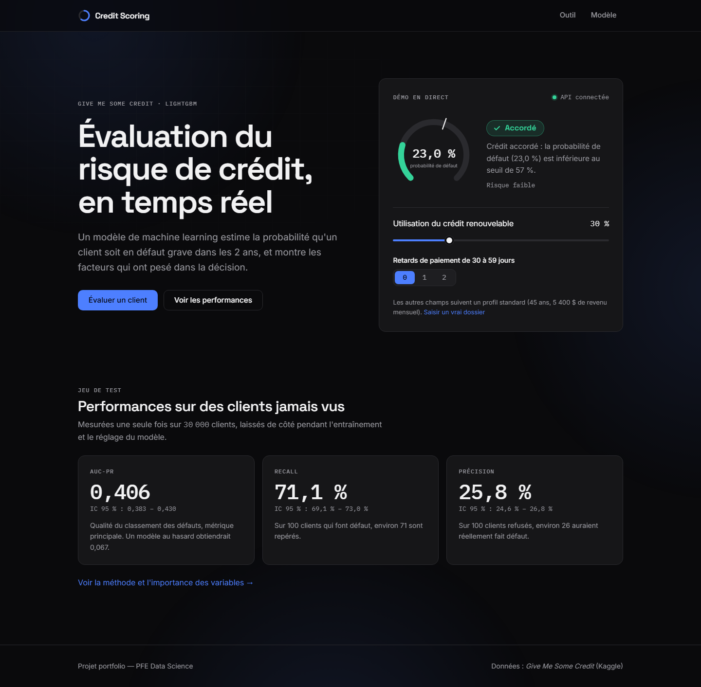
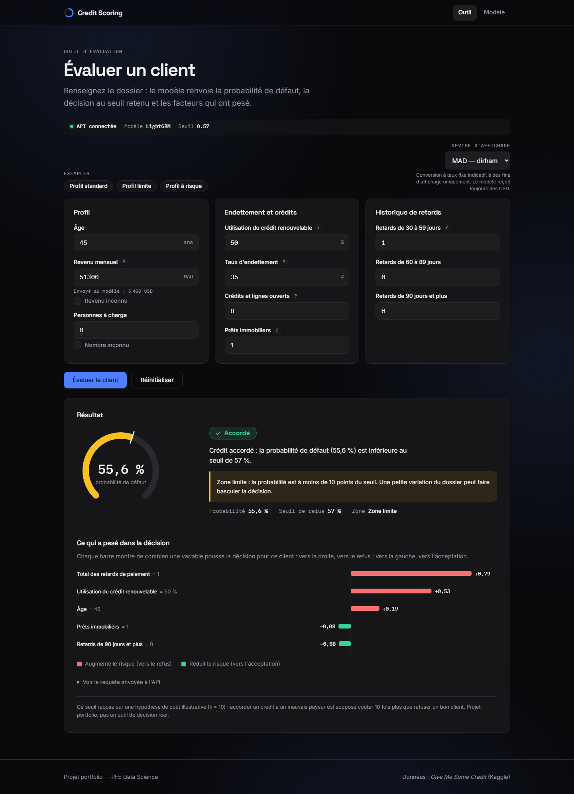
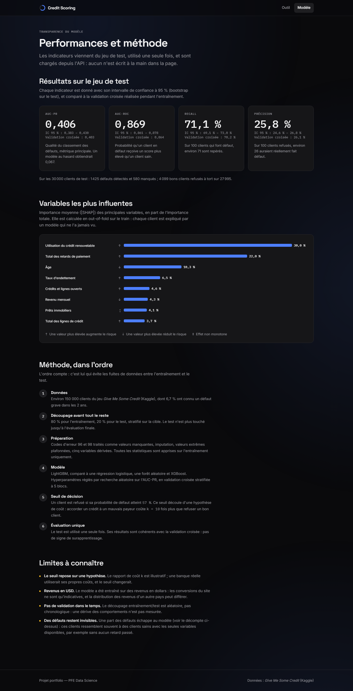

# Credit Scoring — Prédiction de défaut de crédit

Projet portfolio (préparation entretiens stage PFE data science) : prédire la probabilité qu'un
client soit en défaut de paiement grave dans les 2 ans, à partir du dataset Kaggle
["Give Me Some Credit"](https://www.kaggle.com/c/GiveMeSomeCredit).

## Contexte et problème business

Une banque doit décider d'accorder ou non un crédit à un client. Elle veut estimer, au moment de
la demande, la probabilité que ce client connaisse un défaut de paiement grave (retard de 90 jours
ou plus) dans les 2 années suivantes. C'est un problème de **classification binaire** sur données
tabulaires, avec une forte **contrainte métier** : le coût d'une mauvaise décision n'est pas
symétrique (voir section Coût des erreurs).

La cible `SeriousDlqin2yrs` vaut 1 si le client a fait défaut, 0 sinon.

## Données

- Source : Kaggle, compétition [GiveMeSomeCredit](https://www.kaggle.com/c/GiveMeSomeCredit).
- Fichier : `cs-training.csv`, ~150 000 lignes, 1 identifiant + 10 variables explicatives + 1 cible.
- Cible : `SeriousDlqin2yrs` — déséquilibrée, environ 7 % de défauts.
- Variables : âge, revenu mensuel, ratio d'endettement (`DebtRatio`), taux d'utilisation des lignes
  de crédit renouvelables (`RevolvingUtilizationOfUnsecuredLines`), nombre de crédits/prêts
  ouverts, nombre de personnes à charge, et plusieurs compteurs de retards de paiement passés
  (30-59, 60-89, 90+ jours).
- `data/raw/` contient les données brutes, **jamais modifiées**. `data/processed/` contient les
  splits train/test générés par le notebook d'EDA.

## Métriques

- **AUC-PR (Precision-Recall) — métrique principale.** Avec ~7 % de défauts, la classe positive
  est rare : l'AUC-PR est beaucoup plus informative que l'AUC-ROC sur ce type de déséquilibre,
  car elle se concentre sur la capacité du modèle à bien classer la classe minoritaire (celle qui
  nous intéresse métier) sans être "gonflée" par la grande quantité de vrais négatifs faciles.
- **Recall sur la classe défaut** : proportion de mauvais payeurs correctement identifiés. Métier,
  rater un mauvais payeur (faux négatif) coûte cher — c'est un indicateur direct de ce risque.
- **AUC-ROC** : rapportée en complément, pour comparaison avec la littérature/les baselines
  Kaggle, mais à interpréter avec prudence ici (voir ci-dessous).

**Pourquoi l'accuracy est trompeuse** : un modèle qui prédit toujours "pas de défaut" obtient déjà
~93 % d'accuracy (classe majoritaire), sans aucune valeur prédictive. L'accuracy ne dit rien sur
la capacité à détecter les 7 % de clients à risque, qui sont précisément ceux qu'on cherche à
identifier.

## Baselines

1. **Classe majoritaire** : prédire systématiquement "pas de défaut". Sert de plancher — tout
   modèle doit faire mieux que cette baseline sur l'AUC-PR et le recall (l'accuracy de cette
   baseline sera trivialement élevée, ce qui illustre justement pourquoi elle n'est pas une bonne
   métrique).
2. **Régression logistique simple** : modèle linéaire interprétable, avec peu de feature
   engineering. Sert de référence "modèle simple mais raisonnable" avant d'essayer des modèles
   plus complexes (arbres, gradient boosting).

## Coût des erreurs

Les deux types d'erreurs n'ont pas le même coût pour la banque :

- **Faux négatif** (accorder un crédit à un client qui va faire défaut) : perte potentielle du
  capital prêté + intérêts non perçus. Coût élevé.
- **Faux positif** (refuser un crédit à un bon payeur) : manque à gagner sur les intérêts qu'aurait
  rapportés ce client, et coût d'opportunité/réputation. Coût plus faible que le faux négatif.

Cette asymétrie justifie de privilégier le **recall sur la classe défaut** plutôt que l'accuracy,
et guidera plus tard le choix du seuil de décision (pas nécessairement 0.5) une fois un modèle
entraîné.
## Résultats

Modèle final : LightGBM (tuné sur AUC-PR en CV 5 folds), seuil de décision = 0.57.

| Métrique | CV (5 folds) | Test (unique) |
|---|---|---|
| AUC-PR | 0.403 ± 0.004 | 0.406 [IC95% 0.383–0.430] |
| AUC-ROC | 0.864 | 0.869 |
| Recall (défauts) | 0.702 | 0.711 |
| Precision (défauts) | 0.261 | 0.258 |

Traduction métier sur le test : 71 % des mauvais payeurs sont détectés, au prix de refuser 14,6 % des bons clients (18,4 % de refus au total). Les métriques CV et test sont cohérentes — pas de signe d'overfitting.

Variables les plus influentes (SHAP) : taux d'utilisation du crédit renouvelable (30 %), total des retards passés — variable créée en feature engineering (22 %), âge (10 %), taux d'endettement (6,5 %), nombre de lignes de crédit ouvertes (4,6 %).

## Limites

- **Seuil de décision hypothétique** : calibré sur un rapport de coût k=10 illustratif (coût d'un mauvais payeur accepté = 10x coût d'un bon client refusé), à remplacer par de vraies données de coût métier en production.
- **Plafond de performance structurel** : environ 21 % des mauvais payeurs non détectés ont un profil statistiquement indiscernable des bons clients avec les variables disponibles — suggère un besoin de données externes (bureau de crédit, historique bancaire complet) plutôt qu'un problème de modèle.
- **Pas de validation temporelle** : le split train/test est aléatoire, pas chronologique — en production, il faudrait valider sur des données postérieures pour détecter un éventuel drift.
- **Signal contre-intuitif non exploré** : l'absence de revenu déclaré (`income_was_missing`) est associée à un risque plus faible, à l'inverse de l'hypothèse initiale — mériterait une investigation métier plus poussée.


## Prochaines étapes

- Feature engineering (traitement des valeurs manquantes, des valeurs aberrantes identifiées en
  EDA, éventuelles transformations/discrétisations).
- Modélisation : régression logistique (baseline), puis modèles d'arbres (XGBoost, LightGBM).
- Gestion du déséquilibre de classes (pondération, rééchantillonnage) si nécessaire.
- Interprétabilité du modèle final avec SHAP.
- Choix d'un seuil de décision aligné sur le coût métier des erreurs.

## Utilisation

Le modèle final est exposé par une API (FastAPI) et un site web statique (HTML/CSS/JS sans framework,
servi par nginx), lancés ensemble avec Docker.

### Lancer avec Docker

```bash
docker compose up --build
```

| Service | URL | Rôle |
|---|---|---|
| Site web | http://localhost:3000 | Accueil avec démo en direct, outil d'évaluation (`app.html`), page modèle (`model.html`) |
| API | http://localhost:8000 | `POST /predict`, `GET /health`, `GET /model-info` |
| Documentation Swagger | http://localhost:8000/docs | Tester l'API depuis le navigateur |

Arrêt : `docker compose down`.







**Comment le site fonctionne.** Le navigateur appelle directement l'API. Le frontend ne contient aucun chiffre du
modèle en dur : les indicateurs de la page « Modèle » viennent de `GET /model-info` (résultats du test, évalué une
seule fois, extraits du notebook 04 par `python -m src.export_model_info`). Le revenu peut être saisi en MAD, EUR ou
USD à taux fixe indicatif (affichage uniquement) : il est **toujours reconverti en USD** avant l'appel à l'API, car le
modèle a été entraîné sur des revenus en USD.

**Configuration** (variables d'environnement, sans toucher au code) :

| Variable | Service | Rôle | Défaut |
|---|---|---|---|
| `API_URL` | frontend | URL de l'API **vue depuis le navigateur** (écrite dans `js/config.js` au démarrage par nginx) | `http://localhost:8000` |
| `GITHUB_URL` | frontend | Lien GitHub du pied de page (masqué s'il est vide) | vide |
| `ALLOWED_ORIGINS` | api | Origines autorisées à appeler l'API depuis un navigateur, séparées par des virgules | `*` (dev) ; `docker-compose.yml` la restreint au frontend |

Exemple : `GITHUB_URL=https://github.com/<utilisateur>/<depot> docker compose up -d`.

### Exemple de requête

L'API attend les colonnes **originales** du dataset (sans `id` ni la cible). `MonthlyIncome` et
`NumberOfDependents` sont optionnels (imputés comme à l'entraînement s'ils sont absents).
Avec `?explain=true`, la réponse contient les 5 facteurs les plus influents pour ce client (SHAP local).

```bash
curl -X POST "http://localhost:8000/predict?explain=true" \
  -H "Content-Type: application/json" \
  -d '{
    "RevolvingUtilizationOfUnsecuredLines": 0.30,
    "age": 45,
    "NumberOfTime30-59DaysPastDueNotWorse": 0,
    "DebtRatio": 0.35,
    "MonthlyIncome": 5400,
    "NumberOfOpenCreditLinesAndLoans": 8,
    "NumberOfTimes90DaysLate": 0,
    "NumberRealEstateLoansOrLines": 1,
    "NumberOfTime60-89DaysPastDueNotWorse": 0,
    "NumberOfDependents": 0
  }'
```

Réponse (`shap_value` en log-odds : positif = pousse vers le refus, négatif = vers l'acceptation) :

```json
{
  "default_probability": 0.2299,
  "decision": "accepté",
  "threshold": 0.57,
  "top_factors": [
    {"feature": "total_delinquency", "value": 0.0, "shap_value": -0.3075},
    {"feature": "RevolvingUtilizationOfUnsecuredLines", "value": 0.3, "shap_value": 0.2395},
    {"feature": "age", "value": 45.0, "shap_value": 0.2087},
    {"feature": "NumberRealEstateLoansOrLines", "value": 1.0, "shap_value": -0.1108},
    {"feature": "NumberOfOpenCreditLinesAndLoans", "value": 8.0, "shap_value": -0.0942}
  ]
}
```

Sous PowerShell, utiliser `curl.exe` (et non l'alias `curl`) avec le JSON dans un fichier : `-d "@client.json"`.

Les entrées invalides renvoient un code 422 avec un message par champ, par exemple pour un âge de -5 :
`{"error": "Données d'entrée invalides", "details": [{"field": "age", "message": "doit être supérieur ou égal à 18", "received_value": -5}]}`.

### Sans Docker (développement)

```bash
pip install -r requirements-api.txt
uvicorn app.main:app --reload                      # API sur http://localhost:8000
python -m http.server 3000 --directory frontend    # site sur http://localhost:3000
```

Le site est du HTML/CSS/JS pur, sans étape de build : n'importe quel serveur statique convient, et
`frontend/js/config.js` contient l'URL de l'API par défaut (`http://localhost:8000`).

L'API rejoue exactement le pipeline d'entraînement (`src/preprocessing.py`) avec les paramètres appris
sur le train (`models/cleaning_params.json`, régénérable avec `python -m src.export_cleaning_params`).
L'image de l'API utilise `requirements-api.txt` (dépendances minimales aux versions de l'entraînement) ;
`requirements.txt` décrit l'environnement de développement complet.

## Déploiement

Le projet est prévu pour être déployé gratuitement en deux morceaux : l'API sur **Render** (conteneur
Docker), le site statique sur **GitHub Pages**. Aucun des deux n'a été déployé depuis cet environnement
de développement — les étapes ci-dessous sont à faire manuellement, une fois.

### 1. Déployer l'API sur Render

1. Pousser ce dépôt sur GitHub s'il n'y est pas encore (`git remote add origin <url>` puis `git push -u origin main`).
2. Créer un compte sur [render.com](https://render.com) (connexion avec GitHub la plus simple).
3. **New > Blueprint**, sélectionner ce dépôt : Render lit `render.yaml` à la racine et propose de
   créer le service `credit-scoring-api` (Docker, `Dockerfile.api`, plan Free) automatiquement.
   *(Alternative sans Blueprint : **New > Web Service**, sélectionner le dépôt, Environment = Docker,
   Dockerfile Path = `./Dockerfile.api`, Plan = Free.)*
4. Lancer le déploiement et attendre la fin du premier build (plusieurs minutes : les dépendances
   comme LightGBM sont volumineuses). Render fournit lui-même la variable `PORT` ; le `CMD` de
   `Dockerfile.api` s'y adapte automatiquement (`${PORT:-8000}`), rien à configurer.
5. Une fois déployée, noter l'URL du service (`https://credit-scoring-api-xxxx.onrender.com`) et
   vérifier `<cette-url>/health`.

**Plan gratuit Render** : le service se met en veille après 15 minutes sans requête ; la première
requête qui le réveille peut prendre 30 à 60 secondes (`/health` finira par répondre — pas un bug).

### 2. Déployer le frontend sur GitHub Pages

1. Dans `frontend/js/config.js`, remplacer la valeur de `API_BASE_URL` (une seule ligne) par l'URL
   Render obtenue à l'étape précédente, puis commit + push sur `main`.
2. Dans le dépôt GitHub : **Settings > Pages > Source : GitHub Actions** (à faire une seule fois, à la
   main — ce n'est pas un fichier versionné). Le workflow `.github/workflows/deploy-pages.yml` se
   déclenche ensuite automatiquement à chaque push sur `main` qui touche `frontend/` (ou manuellement
   depuis l'onglet **Actions**).
3. Une fois le workflow terminé (onglet Actions), le site est en ligne à
   `https://<utilisateur>.github.io/<nom-du-repo>/`. Tous les liens internes du site sont relatifs :
   il fonctionne aussi bien à la racine d'un domaine que dans ce sous-dossier.

### 3. Reconnecter les deux : CORS

Une fois l'URL GitHub Pages connue, autoriser explicitement cette origine sur Render (Dashboard >
le service > **Environment**, variable `ALLOWED_ORIGINS`, ou modifier la valeur dans `render.yaml` et
redéployer) :

```
ALLOWED_ORIGINS=http://localhost:3000,https://<utilisateur>.github.io
```

### URLs de ce déploiement

- Site (GitHub Pages) : https://hamzaelchen.github.io/credit-scoring/
- API (Render) : https://credit-scoring-api-09rv.onrender.com (documentation Swagger sur `/docs`)

## Structure du projet

```
credit-scoring/
├── data/raw/            # Données brutes (jamais modifiées)
├── data/processed/      # Splits train/test générés par l'EDA
├── notebooks/           # Notebooks Jupyter (EDA, baseline, modélisation, interprétation)
├── src/                 # Pipeline de preprocessing réutilisable
├── app/                 # API FastAPI (main.py)
├── frontend/            # Site statique : index.html, app.html, model.html, css/, js/, assets/
├── nginx/               # Modèle de configuration nginx du frontend
├── models/              # Modèle final, scaler, seuil, paramètres de nettoyage, résultats du test
├── docs/screenshots/    # Captures d'écran du site
├── .github/workflows/   # deploy-pages.yml : publie frontend/ sur GitHub Pages
├── Dockerfile.api / Dockerfile.frontend / docker-compose.yml
├── render.yaml          # Déploiement de l'API sur Render (Blueprint)
├── requirements.txt     # Environnement de développement complet
├── requirements-api.txt # Dépendances minimales de l'API
└── README.md
```

## Installation

```powershell
python -m venv .venv
.\.venv\Scripts\Activate.ps1
pip install -r requirements.txt
```
